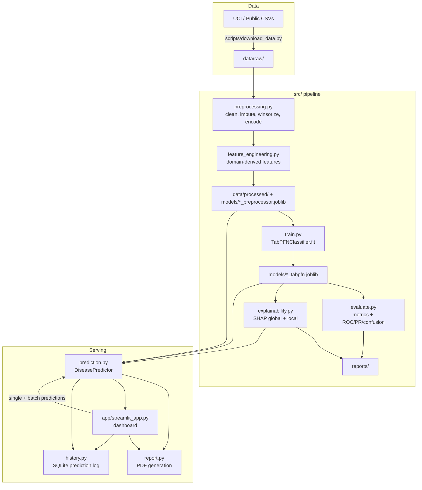
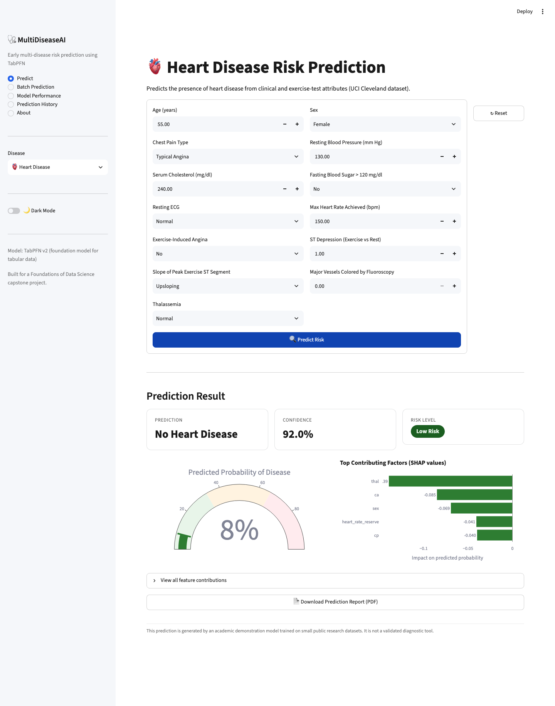
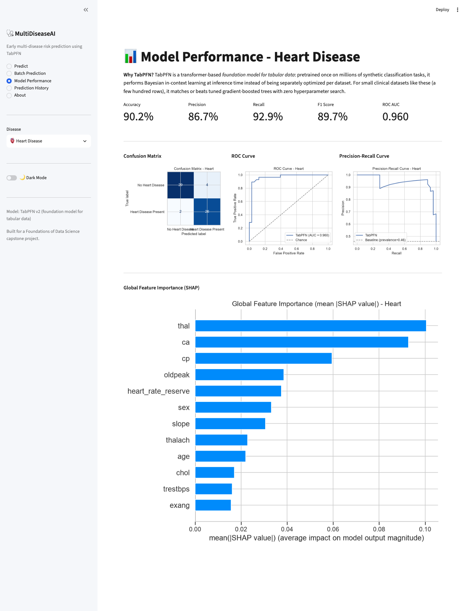
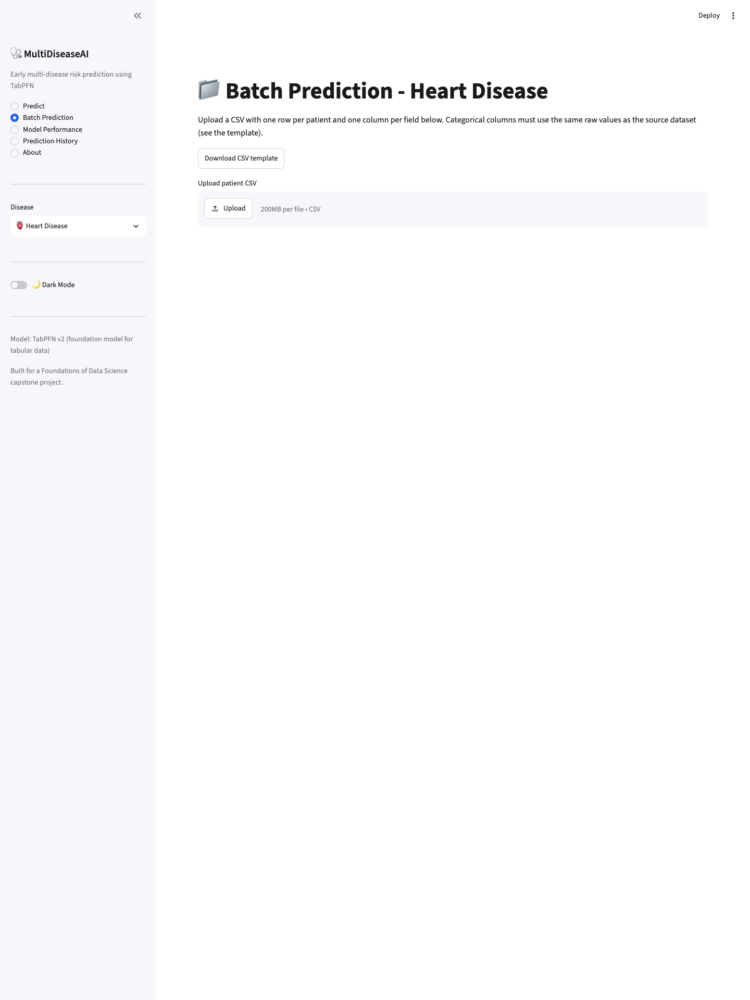
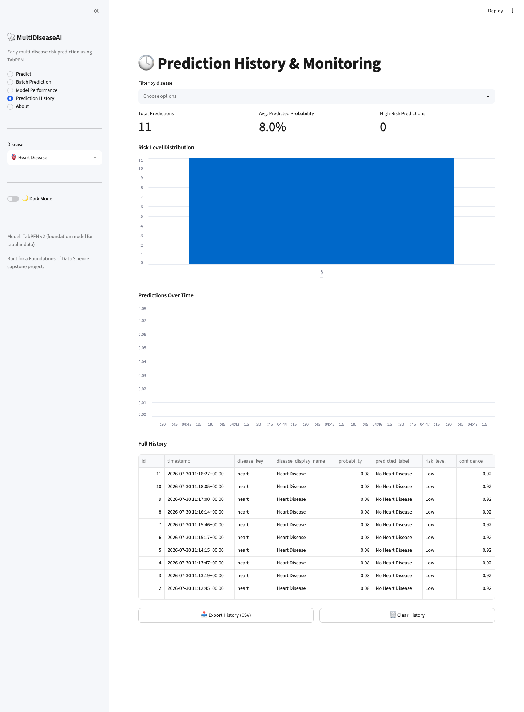
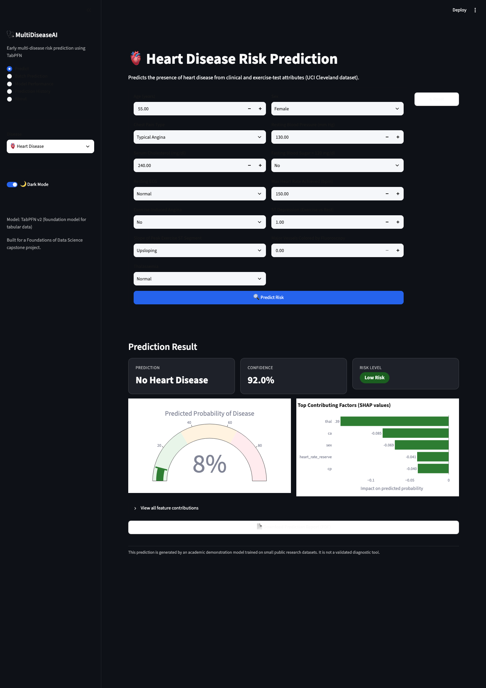
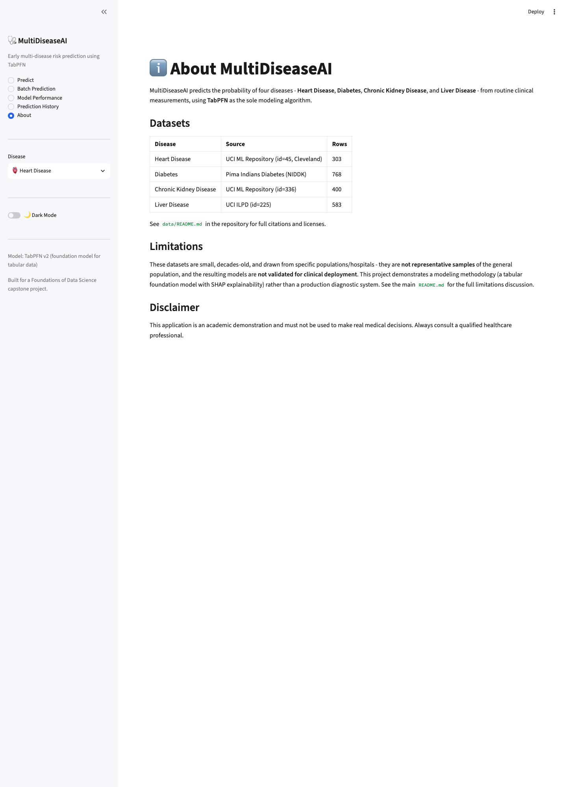

# MultiDiseaseAI

**Early multi-disease risk prediction using TabPFN — a foundation model for tabular healthcare data.**

MultiDiseaseAI predicts the probability of four diseases — **Heart Disease**,
**Diabetes**, **Chronic Kidney Disease**, and **Liver Disease** — from routine
clinical measurements. Every model in this project is trained with
[**TabPFN**](https://github.com/PriorLabs/TabPFN), a transformer-based
foundation model for tabular data, used as the *sole* modeling algorithm
throughout — no Random Forest, XGBoost, or hand-tuned baseline anywhere in
the pipeline. The project pairs that model with a full data-science
workflow: leakage-safe preprocessing, exploratory data analysis, SHAP-based
explainability, a Streamlit dashboard, PDF report generation, Docker
deployment, and a CI-gated test suite.

Built as a capstone project for a Foundations of Data Science course.

---

## Table of Contents

- [Overview](#overview)
- [Why TabPFN?](#why-tabpfn)
- [Architecture](#architecture)
- [Project Structure](#project-structure)
- [Datasets](#datasets)
- [Screenshots](#screenshots)
- [Installation](#installation)
- [Usage](#usage)
- [Results](#results)
- [Explainability](#explainability)
- [Testing](#testing)
- [Docker](#docker)
- [Limitations](#limitations)
- [Future Work](#future-work)
- [References](#references)
- [License](#license)

---

## Overview

For each disease, the pipeline:

1. **Cleans and imputes** raw clinical data (missing-value handling,
   dataset-specific quirks, duplicate removal).
2. **Engineers** clinically-grounded features (e.g. the Rate-Pressure
   Product for heart disease, the De Ritis ratio for liver disease).
3. **Winsorizes outliers** and **ordinally encodes** categorical fields, fit
   strictly on the training split to avoid leakage.
4. **Trains a TabPFNClassifier** — no hyperparameter search needed.
5. **Evaluates** with accuracy, precision, recall, F1, ROC-AUC, confusion
   matrices, and ROC/PR curves.
6. **Explains** predictions with SHAP (global importance + per-patient local
   explanations).
7. **Serves** predictions through a Streamlit dashboard with batch scoring,
   prediction history/monitoring, and downloadable PDF reports.

## Why TabPFN?

Classical tabular ML (gradient-boosted trees, logistic regression, SVMs)
fits a fresh model to every new dataset from scratch, and typically needs a
hyperparameter search to do it well. **TabPFN inverts that**: it is a
transformer pretrained *once*, offline, on millions of synthetic
classification tasks sampled from a structural-causal-model prior. At
inference time it performs **in-context Bayesian learning** — the training
table is not used to update weights, it's used as context that the frozen
transformer attends over to produce a posterior-predictive distribution for
each query row, in a single forward pass.

This project's four datasets (303–768 rows, 8–24 raw features, mixed
numeric/categorical) sit exactly in TabPFN's target regime — small, tabular,
heterogeneous — where the original paper (Hollmann et al., *Nature*, 2025)
reports it matching or beating carefully-tuned gradient-boosted trees
**without any per-dataset tuning**. That property matters here specifically:
this project trains four independent models across four very different
clinical domains, and a from-scratch hyperparameter search for each one
would have been a major share of the project's engineering effort for little
benefit at this data scale. TabPFN also natively accepts a mix of numeric and
categorical columns via `categorical_features_indices`, avoiding one-hot
encoding blow-up on datasets this small.

The trade-off is real and worth stating: TabPFN's context window bounds it
to roughly ≤10,000 rows and ≤500 features per task (well within range for
every dataset here), it doesn't (yet) hand you feature importances the way a
trained tree ensemble does — hence the SHAP layer in `src/explainability.py`
— and, being a hosted foundation model, it currently requires a one-time
license acceptance to download weights (see [Installation](#installation)).

## Architecture



`main.py` orchestrates the top row (download → preprocess → train →
evaluate → explain) end-to-end or per-stage; the Streamlit app is a thin UI
layer over the same `src/` modules used by the pipeline and the test suite,
so there is exactly one implementation of preprocessing/prediction logic
anywhere in the project.

## Project Structure

```
MultiDiseaseAI/
├── data/
│   ├── raw/                  # Downloaded CSVs (scripts/download_data.py)
│   ├── processed/            # Cleaned train/test splits per disease
│   └── README.md             # Dataset sources, licenses, known quirks
├── notebooks/                # Executed per-disease EDA notebooks
├── src/
│   ├── config.py             # Declarative disease registry (single source of truth)
│   ├── artifacts.py          # Picklable preprocessing artifact type
│   ├── preprocessing.py      # Clean -> split -> impute -> winsorize -> encode
│   ├── feature_engineering.py# Clinically-grounded engineered features
│   ├── eda.py                # Reusable EDA plotting utilities
│   ├── train.py               # TabPFNClassifier training
│   ├── evaluate.py           # Metrics + ROC/PR/confusion matrix plots
│   ├── explainability.py     # SHAP global + local explanations
│   ├── prediction.py         # DiseasePredictor (single + batch inference)
│   ├── report.py             # PDF report generation
│   └── history.py            # SQLite prediction history/monitoring
├── app/
│   ├── streamlit_app.py      # 5-page dashboard entry point
│   ├── components.py         # Shared form/chart rendering
│   └── theme.py              # Custom CSS + dark-mode toggle
├── models/                   # Saved TabPFN models + preprocessing artifacts
├── reports/
│   ├── figures/               # EDA + evaluation + SHAP plots
│   └── generated/            # Per-prediction downloadable PDF reports
├── tests/                    # pytest suite (63 tests)
├── scripts/                  # download_data.py, generate_eda_notebooks.py
├── main.py                   # Pipeline orchestrator CLI
├── requirements.txt
├── Dockerfile / docker-compose.yml
├── .github/workflows/ci.yml
└── README.md
```

## Datasets

| Disease | Source | Rows | Target prevalence |
|---|---|---|---|
| Heart Disease | UCI ML Repository (id=45, Cleveland) | 303 | 45.9% |
| Diabetes | Pima Indians Diabetes (NIDDK) | 768 | 34.9% |
| Chronic Kidney Disease | UCI ML Repository (id=336) | 400 | 62.5% |
| Liver Disease | UCI ILPD (id=225) | 583 (570 after de-dup) | 71.2% |

Full citations, licenses, and dataset-specific data-quality notes (e.g. the
Pima dataset's zero-as-missing sentinel values, CKD's whitespace-corrupted
labels) are documented in [`data/README.md`](data/README.md).

## Screenshots

| Predict | Model Performance |
|---|---|
|  |  |

| Batch Prediction | Prediction History |
|---|---|
|  |  |

| Dark Mode | About |
|---|---|
|  |  |

## Installation

### 1. Clone and set up a Python 3.11 environment

```bash
git clone <this-repo-url> MultiDiseaseAI
cd MultiDiseaseAI
python3.11 -m venv .venv
source .venv/bin/activate
pip install -r requirements.txt
```

(Any tool that gives you Python 3.11 works — `uv venv --python 3.11 .venv`
is a fast alternative to the stdlib `venv` above.)

### 2. TabPFN license setup (one-time, required)

TabPFN downloads its pretrained model weights from PriorLabs on first use,
gated behind a one-time license acceptance:

1. Go to <https://ux.priorlabs.ai> and log in or register (free tier
   available).
2. Accept the license under the **Licenses** tab.
3. Copy your API key from <https://ux.priorlabs.ai/account>.
4. Copy `.env.example` to `.env` and paste your key:

   ```bash
   cp .env.example .env
   # then edit .env:  TABPFN_TOKEN=your-api-key-here
   ```

   `src/train.py` and `src/prediction.py` pick up `TABPFN_TOKEN` from the
   environment automatically. Alternatively, run any TabPFN `.fit()` call
   once from an interactive terminal — it will open a browser to complete
   the same login/accept flow and cache the credential locally.

### 3. Download the datasets

```bash
python scripts/download_data.py
```

## Usage

### Run the full pipeline

```bash
python main.py                          # download -> preprocess -> train -> evaluate -> explain, all 4 diseases
python main.py --disease heart          # single disease
python main.py --skip-download          # reuse already-downloaded CSVs
python main.py --stages train,evaluate  # only (re)train + (re)evaluate
```

Or run each stage directly:

```bash
python -m src.preprocessing
python -m src.train --disease heart
python -m src.evaluate --disease heart
python -m src.explainability --disease heart
```

### Launch the dashboard

```bash
streamlit run app/streamlit_app.py
```

Open <http://localhost:8501>. The **Predict** page needs at least one
trained model (`python main.py --disease heart` will train just that one).

### Regenerate the EDA notebooks

```bash
python scripts/generate_eda_notebooks.py
jupyter nbconvert --to notebook --execute --inplace notebooks/*.ipynb
```

## Results

Running `python main.py` populates `reports/{disease}_metrics.json` and the
figures embedded in the **Model Performance** page (confusion matrix, ROC
curve, precision-recall curve, SHAP summary) for each disease, using the
exact evaluation code in [`src/evaluate.py`](src/evaluate.py) — accuracy,
precision, recall, F1, and ROC-AUC on a held-out 20% stratified test split.

This repository intentionally ships **without** committed metric numbers:
producing them requires each user's own TabPFN license/API key (see
[Installation](#installation)), and this project would rather have you look
at metrics from a run you triggered yourself than trust numbers baked into
a README. Every other artifact that doesn't depend on that one external
gate — the EDA notebooks, the preprocessing pipeline, the Streamlit UI, the
test suite — *is* fully executed and checked into this repository.

## Explainability

TabPFN is a transformer, not a tree ensemble or linear model, so SHAP's
closed-form explainers (`TreeExplainer`, `LinearExplainer`) don't apply.
[`src/explainability.py`](src/explainability.py) uses SHAP's model-agnostic
`PermutationExplainer` against `model.predict_proba`, with the background
reference set summarized via k-means to keep runtime tractable given
TabPFN's per-call cost. It produces:

- **Global** feature importance (mean |SHAP value|) and beeswarm plots,
  saved to `reports/figures/` by `src/evaluate.py` / `src/explainability.py`.
- **Local** per-patient explanations (top contributing factors, signed by
  direction) surfaced in the Streamlit Predict page and embedded in every
  downloadable PDF report (`src/report.py`).

## Testing

```bash
pytest tests/ -v
```

63 tests cover the disease-config registry's internal consistency, the
clinically-grounded feature engineering math, the preprocessing pipeline
(leakage-safety, dataset-specific missing-value quirks), the prediction
wiring, and PDF report content. The prediction/report tests swap in a
`LogisticRegression` for the saved model via `monkeypatch` — `DiseasePredictor`
only depends on the sklearn `predict_proba` interface TabPFN also
implements, so this validates all the wiring around the model without
requiring network access to download TabPFN's weights in CI.

## Docker

```bash
cp .env.example .env   # add your TABPFN_TOKEN
docker compose up --build
```

Serves the dashboard at <http://localhost:8501>. `data/`, `models/`, and
`reports/` are mounted as volumes so the pipeline's outputs persist across
container rebuilds.

## Limitations

- **Small, non-representative samples.** All four datasets are decades-old
  and drawn from a single hospital/population (e.g. the Pima dataset is
  restricted to one ethnicity and sex; the CKD dataset is a clinically
  *referred* sample with 62.5% prevalence, nowhere near the general
  population's ~10-15%). Absolute risk scores from this project should not
  be read as population-calibrated probabilities.
- **Not a validated diagnostic tool.** This is an academic demonstration of
  a tabular-foundation-model workflow, not a clinically validated product.
  Every prediction surface in the app carries this disclaimer.
- **TabPFN's context-window limits.** Performance is only established for
  ≤10,000 rows / ≤500 features / ≤10 classes — comfortably true here, but a
  constraint worth stating for anyone extending this to a larger dataset.
- **Imputation on heavily-missing columns.** CKD's `rbc` column is missing
  for 38% of rows; median/most-frequent imputation is a pragmatic baseline,
  not a rigorously validated missing-data model.

## Future Work

- Calibration analysis (reliability diagrams) on top of the existing
  ROC/PR evaluation.
- External validation on a second, independent cohort per disease.
- A model-monitoring view that tracks prediction-distribution drift over
  time, beyond the current history/summary stats in the dashboard.
- Multi-label joint modeling (a patient's comorbidity across diseases)
  instead of four independent single-disease models.

## References

- Hollmann, N., Müller, S., Purucker, L., Krishnakumar, A., Körfer, M., Hoo,
  S. B., Schirrmeister, R. T., & Hutter, F. (2025). Accurate predictions on
  small data with a tabular foundation model. *Nature*, 637, 319-326.
- Hollmann, N., Müller, S., Eggensperger, K., & Hutter, F. (2023). TabPFN: A
  Transformer That Solves Small Tabular Classification Problems in a
  Second. *ICLR 2023*.
- Lundberg, S. M., & Lee, S.-I. (2017). A Unified Approach to Interpreting
  Model Predictions. *NeurIPS 2017*. (SHAP)
- Janosi, A., Steinbrunn, W., Pfisterer, M., & Detrano, R. (1988). Heart
  Disease. *UCI Machine Learning Repository*. https://doi.org/10.24432/C52P4X
- Smith, J. W., Everhart, J. E., Dickson, W. C., Knowler, W. C., & Johannes,
  R. S. (1988). Using the ADAP learning algorithm to forecast the onset of
  diabetes mellitus. *Proc. Symposium on Computer Applications and Medical
  Care*.
- Rubini, L., Soundarapandian, P., & Eswaran, P. (2015). Chronic Kidney
  Disease. *UCI Machine Learning Repository*. https://doi.org/10.24432/C5G020
- Ramana, B., & Venkateswarlu, N. (2012). ILPD (Indian Liver Patient
  Dataset). *UCI Machine Learning Repository*. https://doi.org/10.24432/C5D02C

## License

This project's source code is available for academic and research use. The
underlying datasets carry their own terms — see [`data/README.md`](data/README.md).
TabPFN's model weights are distributed by PriorLabs under their own license,
accepted separately by each user (see [Installation](#installation)).
