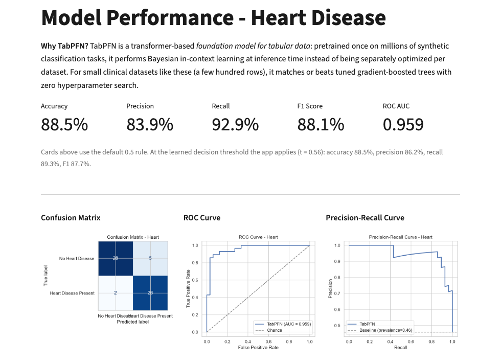

TITLE: MultiDiseaseAI: A Leakage-Safe Serving Pipeline Around a Tabular Foundation Model, and What Each Design Choice Buys on Four Small Clinical Datasets
AUTHOR: Albert Mathew
AFFILIATION: {{PENDING: affiliation, to be added by the author}}

ABSTRACT:
A tabular foundation model such as TabPFN can serve a classifier for a small clinical table without hyperparameter search, but a usable system also needs preprocessing, a decision rule, an uncertainty statement, a novelty warning and explanations. We describe MultiDiseaseAI, a pipeline wrapping one TabPFN model per disease (heart, diabetes, kidney, liver disease; 303–768 patients) in a leakage-safe, replayable transform and three cheap add-ons: an out-of-fold residual band, a Youden threshold and a Ledoit–Wolf Mahalanobis novelty flag. We tested each choice, including TabPFN itself, against four reference models under a paired, corrected resampling protocol. TabPFN reached the highest or joint-highest cross-validated AUC on three of four tasks with no tuning, significantly ahead only of the weaker baselines (an SVM, on three tasks; boosting, on one), not of logistic regression or random forest. Sixty-eight preprocessing comparisons, including TabPFN's own, found no significant difference from the shipped pipeline; fitting on train-plus-test data moved AUC by at most 0.0015. The learned threshold beat a fixed 0.5 cutoff only on the imbalanced liver task (p ≤ 0.002) and never beat a simple prevalence rule. For every model the band is exactly a conformal label set: 0.90 to 0.93 coverage at a nominal 0.90, within 0.018 of CV+, at 0.5 µs per query, collapsing to near zero on the one near-separable task. The novelty flag held its nominal rate at 9 to 14 µs per row, though a one-class SVM caught an age shift better. Cutting the SHAP background from 25 to 10 rows, unbenchmarked before this work, saved 1.3 to 2.4× with high rank agreement; KernelSHAP was not uniformly slower, against a cited finding. The evidence supports calling these choices cheap and competitive, and TabPFN a defensible default rather than a proven best.

KEYWORDS: tabular foundation models, TabPFN, clinical prediction, conformal prediction, data leakage, out-of-distribution detection

## I. Introduction

Routine clinical tables are small. The four public datasets used here hold between 303 and 768 patients, and the usual response is to tune a classifier for each one. TabPFN offers a different route: a transformer pretrained once on synthetic tasks, whose "fitting" step stores the training table and whose prediction is a single forward pass [1]. Its authors report the clearest advantage on tables with as many as ten thousand rows and five hundred columns, a range that contains all four of our datasets.

Whether that advantage holds on clinical data is less settled. A benchmark preprint reports that TabPFN was generally competitive across twelve binary clinical tasks but best in only 16.7% of them and about 5.5 times slower [2], while a fine-tuning study reports that a fine-tuned TabPFN consistently outperformed conventional methods on clinical prediction tasks [3]. A deployed tool built on TabPFN also makes many choices around the model, such as how to impute, where to cut the probability, how to express uncertainty and when to warn that a patient is unusual. The repository gives reasons for each of these choices but no measurements of them (Section III). This paper supplies the measurements.

MultiDiseaseAI is a config-driven pipeline and Streamlit application that serves one TabPFN model per disease. Our contributions are:

1. A description of the system as implemented, including the exact form of its uncertainty band: a global-width residual band whose target is the binary label, which read as a set of labels is a conformal label set (Section III).
2. Head-to-head measurements of six design choices, including TabPFN itself against four reference models, with paired tests that account for overlapping resamples (Section V).
3. A reproducible, provenance-stamped harness that reruns identically once new evidence (a licence token, a new dataset) is available.

We do not claim clinical validity. Every number below was measured on this project's own pipeline, on real held-out data, with no invented values; where a comparison found no significant difference, we report that rather than a preference.

## II. Related Work

**Tabular foundation models and clinical evidence.** Prior-data fitted networks train a set-input transformer on tasks sampled from a prior so that one forward pass approximates a posterior predictive distribution [4]. The first TabPFN applied this to small numeric datasets, with at most 1,000 training rows, 100 numeric features and 10 classes [5]. Its 2025 successor extends the range to 10,000 samples and 500 features, handles categorical features and missing values, and reports its advantage against baselines tuned for hours [1]. Earlier evidence that tree ensembles stay ahead of neural networks at around ten thousand samples [6] predates this generation. Clinical evidence is mixed, as the Introduction noted; both studies were read at abstract level only, and the first is not peer reviewed. This project does not fine-tune, and it keeps reference models for that reason.

**Explaining TabPFN.** SHAP defines additive feature attributions in a unified framework [7]. TabPFN-specific methods exploit in-context learning to compute Shapley values and leave-one-covariate-out importances without retraining [8], and one workshop paper proposes a model that emits its own Shapley explanation in a single pass, reporting model-agnostic KernelSHAP as far slower in its setting [9] — a finding Section V-F tests directly. Shapley importances also carry conceptual caveats [10]. We use the model-agnostic permutation explainer with a k-means background to bound cost, and do not compare it with the TabPFN-specific methods.

**Uncertainty, decision thresholds and novelty.** The jackknife interval adds and subtracts a quantile of leave-one-out residuals and can have very poor coverage in some settings; jackknife+ and CV+ repair this with a worst-case coverage guarantee of about 1−2α but need every fold model at the test point [11]. Cross-conformal prediction was studied largely empirically [12]; marginal coverage is what conformal methods deliver, and how informative the sets are depends on the score function [13]. Mahalanobis distance on class-conditional Gaussians is used for out-of-distribution detection in deep networks [14]; we fit one shrunk Gaussian [15] on encoded inputs instead. The Youden index weights sensitivity and specificity equally [16], and modern neural networks are often poorly calibrated [17], which we did not assess. Our band is a K-fold analogue of the jackknife interval, tested here against CV+ and a label-set formulation.

**Evaluation practice and the data.** Leakage errors have been reported in 17 research fields, touching 329 papers, with some conclusions badly overoptimistic; one catalogued form is preprocessing fitted on training and test data together [18]. Small samples give wide error bars that fold-to-fold spread understates [19], and variance estimates that ignore the choice of training set can grossly underestimate the variance of resampled comparisons, which the corrected resampled t-test addresses [20]. We adopt that test, Wilson intervals [21] and percentile bootstrap intervals for the fixed split; improved bootstrap intervals exist [22]. Applied work on these datasets includes a 12-classifier comparison reporting 0.983 accuracy for gradient-boosted trees on kidney disease [23] and a heart-disease system with feature engineering [24]; a study that recreated published liver-disease classifiers found a higher false-negative rate for female patients across all of them [25].

## III. System Design

Fig. 1 shows the pipeline. Everything the model needs at serving time is in one bundle per disease.

**Data and preprocessing.** A configuration file registers each disease's columns, target and form fields, so adding a disease means adding an entry. The order is deterministic cleaning, one stratified 80/20 split (seed 42), median or most-frequent imputation, 1.5×IQR winsorization, ordinal encoding and feature engineering. Every fitted statistic comes from the training split, a unit test checks the winsorization bounds against the imputed training split, and a saved artifact replays the identical transform on a live record. The engineered features are the rate-pressure product, heart-rate reserve and cholesterol/age (heart); glucose×BMI and insulin/glucose (diabetes); a comorbidity count (kidney); and AST/ALT and direct/total bilirubin (liver).

**Model.** Each disease gets `TabPFNClassifier(n_estimators=8, random_state=42)` on CPU with categorical column indices, package version 8.2.0, and no hyperparameter search. TabPFN is the only classifier in the shipped system.

**Precomputed add-ons.** A stratified five-fold out-of-fold pass over the training split (folds capped at the smaller class) yields three artifacts.

*Band.* With out-of-fold probabilities $p_i$ and labels $y_i \in \{0,1\}$, the half-width $h$ is the $\lceil (n+1)(1-\alpha) \rceil$-th smallest residual $|y_i - p_i|$, with $\alpha = 0.10$. A patient with probability $p$ receives the band $[p-h,\, p+h]$ clipped to $[0,1]$. Two properties matter for interpretation. First, $h$ is one constant per disease, so the band is not adaptive to the patient. Second, for a binary label $|y-p| = 1-p_y$, where $p_y$ is the probability assigned to the true label, so the band contains label $y$ exactly when $1-p_y \le h$. Read as the set of labels it contains, the band is therefore the conformal label set with score $1-p_y$. Its target is coverage of the label, not of the unknown true probability, and it is approximate because fold-model residuals are applied to the full-data model. It resembles the plain jackknife interval [11] computed from K folds; it is not CV+.

*Threshold.* The decision threshold is the out-of-fold probability that maximises Youden's $J$ = sensitivity + specificity − 1 [16], clamped to [0.01, 0.99].

*Novelty flag.* A Ledoit–Wolf-shrunk Gaussian is fit to the encoded training matrix, and a live record is flagged when its Mahalanobis distance exceeds the 97.5% training-distance quantile.

**Recorded rationale.** The repository states its reasons for these choices in code comments and documentation. TabPFN was specified as the only classifier because, on small mixed-type tables, it was reported to match tuned boosted trees without a search that would otherwise be needed per disease. The Youden threshold replaces a blind 0.5 cutoff, computed out-of-fold so it never touches the test split. The band replaces "confidence as distance from 0.5" with an interval. The novelty flag exists because every source dataset is small and demographically narrow. The interactive SHAP background was cut from 25 to 10 rows for latency, unbenchmarked when this project started; Section V-F reports the benchmark.

**Serving and explanations.** A prediction is one forward pass, a band lookup, a threshold comparison and a novelty distance. The label is $p \ge$ threshold. SHAP values come from a permutation explainer on `predict_proba` with a k-means background of 25 rows for global plots and 10 for interactive use [7]. The application adds batch scoring, PDF reports, a SQLite prediction history and Docker and Hugging Face Space files; it is meant to run locally, and we made no deployment. Eighty-one tests pass, but the prediction wiring is tested with a logistic-regression stand-in rather than TabPFN.

## IV. Experimental Setup

**Data.** Table I lists the datasets, all public. Heart disease uses the Cleveland subset of the UCI data [26], [27]. Diabetes is the Pima Indians data, whose documentation describes 768 female patients aged at least 21 of Pima heritage [28]. Kidney disease is the UCI CKD data [29] and liver disease is the Indian Liver Patient Dataset [30]. Cleaning matters: 5, 35, 227, 374 and 11 Pima zeros in glucose, blood pressure, skin thickness, insulin and BMI are treated as missing; kidney missingness reaches 152 of 400 rows (`rbc`); heart has 4 missing `ca` and 2 missing `thal`; and ILPD has 13 duplicate rows, which are dropped, and 4 missing A/G ratios.

Table: Datasets after cleaning. Test positives are counted in the shipped 20% split.

| Disease | Rows | Features | Train / test | Positive rate | Test positives |
|---|---|---|---|---|---|
| Heart | 303 | 16 | 242 / 61 | 45.9% | 28 |
| Diabetes | 768 | 10 | 614 / 154 | 34.9% | 54 |
| Kidney | 400 | 25 | 320 / 80 | 62.5% | 50 |
| Liver | 570 | 12 | 456 / 114 | 71.3% | 81 |

**Protocol.** Comparisons use repeated stratified five-fold cross-validation with three repeats (15 folds), refitting all preprocessing inside each training fold. Because the 15 test folds overlap, we compare methods with the Nadeau–Bengio corrected resampled t-test, whose variance factor is $1/J + n_2/n_1$ [20], and we do not read fold spread as a confidence interval. Fixed-split results use the shipped split with 2,000-resample percentile bootstrap intervals, and coverage uses Wilson intervals [21].

**Models.** Logistic regression (standardised), histogram gradient boosting, random forest and an RBF SVM serve as reference models against TabPFN (`n_estimators=8`, CPU, package version 8.2.0, no search, as shipped). In the main comparison the reference models each get an inner five-fold grid search on the training split (26, 61, 21 and 16 fits respectively); TabPFN gets none. In the design-choice studies all models run with fixed settings so only the studied factor varies; TabPFN joined the preprocessing and threshold ablations alongside logistic regression and gradient boosting, at one repeat instead of three for compute cost. Logistic regression cannot take missing values, so the native-missing variant excludes it; TabPFN and gradient boosting both accept missing values natively and both ran it.

**Metrics.** Discrimination is ROC-AUC. Decision rules are scored by balanced accuracy (mean of sensitivity and specificity), which does not reward predicting the majority class. Interval methods are read as label sets, scored by coverage (share of true labels in the set), mean set size, and singleton/both-label/empty shares. Timings are single-row CPU calls, averaged over 100 rows (novelty) or 20,000 (band lookup). Reference models and utilities come from scikit-learn [31].

**Environment.** Everything ran on CPU with scikit-learn 1.9.0, torch 2.13.0 and tabpfn 8.2.0; TabPFN's weights (its "v3" default checkpoint) were downloaded once under a non-commercial licence accepted by the account holder. Each result file records the git commit, a dirty-tree flag and package versions, across four commits between which the preprocessing, feature-engineering and artifact code did not change.

## V. Results

### A. TabPFN against the reference models

Table II gives cross-validated AUC. Among the reference models alone, differences on heart and diabetes are at most 0.013 AUC, smaller than the 0.03 to 0.04 fold-to-fold standard deviation, and on kidney disease every model reaches 1.000, which cannot discriminate between them. The one clear separation is liver, where the SVM (0.660) trails logistic regression (0.744). Logistic regression is at least as good as gradient boosting on all four tasks, by 0.0003 to 0.0218. The single 114-row liver split overstates this gap (0.816 [0.741, 0.887] against 0.729 [0.632, 0.818]), a small illustration of why one split is a weak basis for choosing a model [19].

TabPFN reached the highest or joint-highest mean AUC on three of the four tasks: heart 0.918 (best reference model: logistic regression, 0.909), diabetes 0.843 (best reference: random forest, 0.840), kidney 1.000 (tied with every reference model). On liver it placed second, 0.741 against logistic regression's 0.744. It needed no hyperparameter search, where the reference models needed 16 to 61 fits per outer fold; its own fit-and-predict cost (1.0 to 1.8 s per fold) sits between logistic regression's near-zero cost and gradient boosting's 6.5 to 10.3 s, and is comparable to random forest's tuned cost.

Table: Cross-validated ROC-AUC (5 folds × 3 repeats) and wall-clock seconds per outer fold, including the reference models' inner tuning; TabPFN gets no search. CPU.

| Model | Heart | Diabetes | Kidney | Liver | Seconds/fold |
|---|---|---|---|---|---|
| TabPFN | **0.918** | **0.843** | 1.000 | 0.741 | 1.0–1.8 |
| Logistic regression | 0.909 | 0.839 | 1.000 | **0.744** | 0.05 |
| Random forest | 0.904 | 0.840 | 1.000 | 0.734 | 1.4–1.8 |
| Gradient boosting | 0.901 | 0.831 | 1.000 | 0.722 | 6.5–10.3 |
| RBF SVM | 0.896 | 0.827 | 1.000 | 0.660 | 0.05–0.20 |

Numerically ahead is not the same as significantly ahead. Table III gives the paired Nadeau–Bengio test, TabPFN minus each reference model, over the same 15 folds. TabPFN was significantly better than the SVM on three of the four tasks (kidney is untestable, both scoring 1.000 with zero variance) and significantly better than gradient boosting on one (diabetes, +0.0125, p = 0.047), but never significantly different from logistic regression (p = 0.145–0.734) or random forest (p = 0.071–0.653) on any task. This matches the clinical-benchmark preprint's finding: generally competitive, decisively ahead of the weaker baseline, not of the strongest one [2].

Table: TabPFN minus reference model, mean AUC difference and Nadeau–Bengio p (15 folds; kidney vs SVM has zero variance, no test defined).

| Disease | vs HGB | vs LogReg | vs RF | vs SVM |
|---|---|---|---|---|
| Heart | +0.017 (p=.104) | +0.009 (p=.145) | +0.015 (p=.071) | **+0.022 (p=.029)** |
| Diabetes | **+0.013 (p=.047)** | +0.004 (p=.396) | +0.004 (p=.378) | **+0.017 (p=.007)** |
| Kidney | +0.000 (p=.414) | +0.000 (p=.653) | +0.000 (p=.653) | +0.000 (n/a) |
| Liver | +0.019 (p=.068) | −0.003 (p=.734) | +0.007 (p=.498) | **+0.081 (p<.001)** |

The shipped 20% split is a coarse instrument: TabPFN's fixed-split AUC was 0.959 [0.902, 0.996] on 61 heart-disease test patients, nominally above logistic regression's 0.956 [0.894, 0.996] and boosting's 0.949 [0.886, 0.992], but the three intervals overlap almost entirely; diabetes shows the same pattern (0.821 [0.752, 0.887] vs 0.809 [0.739, 0.877]). Such differences should not be read as findings on their own; the repeated-CV result above is the one we rely on.

### B. Preprocessing and leakage

We replaced the project's pipeline (median imputation, winsorization, engineered features, train-only fitting) with each alternative in turn: for logistic regression and gradient boosting at three repeats (44 pairs), and for TabPFN at one repeat, compute cost permitting (24 pairs; TabPFN also natively accepts missing values, so it ran the native-missing variant too, unlike logistic regression). Table IV summarises all 68 pairs. None reached p < 0.05 in either group; the smallest p was 0.205 (reference models) and 0.100 (TabPFN); the largest change in AUC was 0.0056 (reference models) and 0.0041 (TabPFN). Removing the engineered features lowered AUC in two reference-model pairs, both gradient boosting (heart −0.0053, liver −0.0051), raised it in the rest by at most 0.0031, and left kidney disease unchanged for every model. So we cannot claim that winsorization, median imputation or the engineered features improve accuracy for any of the three models tested, and we cannot claim they harm it.

Table: Change in ROC-AUC relative to the project's preprocessing (variant minus project); smallest Nadeau–Bengio p over pairs with a defined test.

| Variant | Ref. pairs | Ref. ΔAUC range | Ref. min p | TabPFN pairs | TabPFN ΔAUC range | TabPFN min p |
|---|---|---|---|---|---|---|
| No winsorization | 8 | −0.0021 to +0.0011 | 0.524 | 4 | −0.0017 to +0.0041 | 0.264 |
| No engineered features | 8 | −0.0053 to +0.0018 | 0.205 | 4 | −0.0013 to +0.0031 | 0.444 |
| Mean imputation | 8 | −0.0035 to +0.0009 | 0.437 | 4 | −0.0022 to +0.0006 | 0.338 |
| kNN imputation (k = 5) | 8 | −0.0022 to +0.0025 | 0.259 | 4 | −0.0039 to +0.0010 | 0.100 |
| Native missing values | 4 | −0.0056 to +0.0006 | 0.363 | 4 | −0.0006 to +0.0003 | 0.704 |
| Leaky: fit on train + test | 8 | −0.0003 to +0.0015 | 0.512 | 4 | −0.0001 to +0.0012 | 0.184 |

The leaky variant fits the imputation and winsorization statistics on train plus test data, the form the leakage taxonomy lists as preprocessing on the training and test set [18]. It changed AUC by at most 0.0015 for the reference models and 0.0012 for TabPFN. On these datasets the leak-safe design therefore costs nothing measurable for any of the three models tested, and its justification is correctness rather than accuracy. This does not show that leakage is harmless in general: medians and IQR bounds are low-capacity statistics, and we did not test flexible preprocessing such as target encoding. Native missing-value handling was not distinguishable from imputation for either gradient boosting or TabPFN [1], so imputation does not appear necessary for models that accept missing values directly.

### C. Decision threshold

We compared the project's Youden rule with a fixed 0.5 cutoff, the F1-optimal threshold and the training prevalence, each chosen on inner out-of-fold predictions and scored on the outer fold by balanced accuracy, for the two reference models at three repeats and TabPFN at one (Table V). Against 0.5, Youden was significantly better only on liver disease, for every model tested: +0.086 to +0.096 for the reference models (p ≤ 0.002) and +0.121 for TabPFN (p < 0.001), where 71% of patients are positive and a 0.5 cutoff gives TabPFN a specificity of only 0.18. On diabetes the gain was +0.024 to +0.044 but never significant (p = 0.13 to 0.25 for the reference models, p = 0.15 for TabPFN); on heart and kidney disease every model's difference from 0.5 was within −0.019 to −0.002 and not significant (p ≥ 0.23). The F1-optimal rule collapses on liver disease for all three models, predicting almost everyone positive (mean specificity 0.01 to 0.03), and Youden beats it there by 0.16 to 0.18 (p ≤ 0.004). Against the training-prevalence rule there was no significant difference for any model on any disease (smallest p 0.226, largest gap 0.018). The pattern found with the reference models therefore holds for TabPFN too: Youden is a sound choice on imbalanced tasks, but a one-line prevalence rule performed as well.

The gain on liver disease is a trade, not a free improvement. The Youden rule raised specificity from 0.18–0.33 to 0.80–0.84 across the three models, but lowered sensitivity from 0.84–0.92 to 0.53–0.55, and the positive-class F1 fell to 0.66–0.67. A screening tool that must not miss cases might reasonably prefer the 0.5 rule. Which balance is right depends on the clinical cost of a missed case against a false alarm, which no dataset here can settle.

Table: Balanced accuracy by decision rule, logistic regression / gradient boosting / TabPFN, mean over outer folds (15 for the reference models, 5 for TabPFN).

| Rule | Heart | Diabetes | Kidney | Liver |
|---|---|---|---|---|
| Fixed 0.5 | .838 / .819 / .846 | .721 / .716 / .719 | .999 / .996 / 1.000 | .588 / .585 / .553 |
| Youden J (project) | .831 / .815 / .828 | .745 / .742 / .763 | .994 / .994 / .996 | .684 / .670 / .675 |
| F1-optimal | .827 / .817 / .834 | .746 / .745 / .768 | .994 / .992 / .997 | .502 / .509 / .504 |
| Training prevalence | .841 / .823 / .845 | .753 / .745 / .770 | .991 / .996 / 1.000 | .689 / .671 / .681 |

### D. Uncertainty band

We evaluated the band and two alternatives at α = 0.10 by reading each as a set of labels: the project band, CV+ [11] and the conformal label set with score $1-p_y$ (Table VI), for the two reference models and TabPFN. The band and the label-set method gave identical coverage, set size and singleton, both-label and empty rates in all twelve model–disease pairs, as Section III implies. Coverage was 0.900 to 0.920 for the reference models and 0.901 to 0.930 for TabPFN, against a nominal 0.90. CV+ covered 0.898 to 0.929 (reference models) and 0.904 to 0.912 (TabPFN), within 0.018 of the band across all three models. On the tuned reference models of the main comparison, the band's outer-fold label coverage was 0.897 to 0.920 and every Wilson 95% interval contained 0.90.

Table: Label coverage (nominal 0.90) and share of singleton label sets, logistic regression / gradient boosting / TabPFN. The band and the label-set method are identical.

| Quantity | Heart | Diabetes | Kidney | Liver |
|---|---|---|---|---|
| Coverage, band | .906/.904/.901 | .900/.905/.904 | .918/.920/**.930** | .904/.917/.905 |
| Coverage, CV+ | .905/.913/.904 | .898/.911/.908 | .907/.922/.912 | .910/.929/.912 |
| Singleton, band | .815/.766/**.862** | .670/.648/.697 | .918/.920/**.930** | .580/.526/.567 |

Validity is not informativeness [13]. The singleton-set share, where the band excludes one label, ranged from 0.53 (liver, gradient boosting) to 0.93 (kidney, TabPFN). On liver about half of predictions carry both labels for every model: the band says "either", a weak classifier rather than a flaw in the band. On kidney disease TabPFN's own residuals nearly vanish — mean band width 0.001, against 0.012–0.084 for the reference models — because the fitted probabilities cluster at 0 or 1 with almost no out-of-fold error on this near-separable task; all three kidney worked examples in Section V-F land on an exact [0,0] or [1,1] band. That is the band behaving as designed, not a defect, but it leaves no calibrated margin for the rare kidney patient the model gets wrong; on the harder tasks the band stayed wide (0.80–0.88 for TabPFN). A lookup costs 0.53 µs regardless of model. CV+ needs all K fold models at the query point [11], so serving it would take five forward passes instead of one, by definition; we did not time it. Not tested: coverage within subgroups, and calibration of the underlying probabilities.

### E. Novelty flag

We compared the Ledoit–Wolf Mahalanobis flag with the empirical-covariance version, Isolation Forest, kNN distance, Local Outlier Factor and a one-class SVM, all set to a 2.5% training flag rate. Two questions were asked: does each hold its nominal rate on held-out normal rows, and does it respond to a shift? For the shift we fit each detector on the younger half of a dataset by age and compared flag rates and score separation (AUROC) for held-out younger against older rows. This is a covariate shift on real data, not a guarantee about arbitrary novelty.

Table: Novelty detectors. Flag rate on held-out normal rows in 5-fold CV (nominal 0.025), age-shift AUROC, and query time per row.

| Detector | CV flag rate | AUROC: kidney / diabetes / heart / liver | µs per row |
|---|---|---|---|
| Mahalanobis + Ledoit–Wolf (project) | 0.030–0.036 | .638 / .946 / .888 / .909 | 9–14 |
| Mahalanobis, empirical covariance | 0.030–0.087 | .672 / .936 / .888 / .798 | 8–13 |
| Isolation Forest | 0.030–0.048 | .637 / .814 / .750 / .601 | 1544–1552 |
| kNN distance (k = 5) | 0.020–0.040 | .685 / .906 / .843 / .798 | 155–458 |
| Local Outlier Factor | 0.020–0.028 | .679 / .951 / .827 / .809 | 185–512 |
| One-class SVM | 0.108–0.237 | .680 / .968 / .899 / .951 | 92–102 |

The project's detector held its nominal rate on all four datasets (0.030 to 0.036) and was among the cheapest, at 9 to 14 µs per row (the empirical-covariance variant is equally cheap) against 92 to 1,552 µs for the other four. It was not the most sensitive. The one-class SVM scored a higher AUROC on all four datasets but flagged 11% to 24% of normal held-out rows, so its threshold is not usable without recalibration. Shrinkage helped: the empirical covariance flagged 8.7% of held-out kidney rows against 3.0%, and its liver AUROC was 0.798 against 0.909. On heart disease the project flag rose from 6.1% of younger held-out patients to 57.4% of older ones. On kidney disease no detector separated the age groups well (AUROC 0.64 to 0.69), so the flag's response there is unproven.

### F. Explanations and sample predictions

We timed a single-row `predict_proba` call in a loop over the first 20 test rows of each disease, then the permutation explainer at background sizes 10 and 25 on the same rows, then KernelSHAP at background 10 for comparison (Table VIII). A single unbatched prediction cost 0.70 to 1.17 seconds. A separate, direct comparison on the same fitted model — the same 20 rows scored one at a time versus batched — found the single-row path 18 to 20 times slower per row (581–1,144 ms singly against 32–59 ms per row batched). The interactive, one-patient-at-a-time dashboard path therefore does not get TabPFN's batching efficiency; a form submission pays close to the full per-call overhead every time.

Table: SHAP background 10 vs 25 (median seconds per explanation, 20 test rows, CPU) and single-row `predict_proba` latency.

| Disease | predict_proba (ms/row) | bg = 10 (s) | bg = 25 (s) | Speed-up | Spearman (mean / min) | Top-3 overlap (mean / min) |
|---|---|---|---|---|---|---|
| Kidney (25 features) | 902 | 18.7 | 24.4 | 1.31× | 0.92 / 0.84 | 1.95 / 0 |
| Diabetes (10 features) | 1167 | 15.8 | 37.4 | 2.37× | 0.93 / 0.67 | 2.75 / 2 |
| Heart (16 features) | 702 | 18.0 | 27.0 | 1.50× | 0.96 / 0.92 | 2.70 / 2 |
| Liver (12 features) | 898 | 25.9 | 33.9 | 1.31× | 0.95 / 0.85 | 2.80 / 2 |

Cutting the background from 25 to 10 rows saved 1.3 to 2.4× on explanation time, with high mean rank agreement (Spearman 0.92–0.96). The saving and the agreement varied by dataset rather than tracking feature count simply: diabetes (10 features) gave the largest saving (2.37×) but the widest per-row spread (Spearman as low as 0.67 for one patient); kidney (25 features) gave the smallest top-3 overlap (1.95 of 3) and the only case where the two background sizes agreed on *none* of the top three features for one patient — plausibly because, once many features carry near-zero attribution on this near-separable task, their relative ranking is dominated by sampling noise a larger background does not resolve; we did not test this further. KernelSHAP did not uniformly lose to the permutation explainer as the background-10 comparison in [9] suggests: it beat permutation-background-25 on diabetes (16.95 s vs 37.4 s) and liver (29.63 s vs 33.9 s), and lost on heart (34.05 s vs 27.0 s) and kidney (38.1 s vs 24.4 s), with rank agreement against permutation-25 of 0.82–0.96 — the literature finding does not transfer cleanly here; neither explainer dominates.

Table IX shows three of twelve worked examples (all twelve, with inputs, band, threshold, label, novelty flag and top contributors, are in `results/worked_examples.md`), drawn from real held-out rows by a rule fixed in advance: the first true positive, the first true negative, and the most novel row by Mahalanobis distance. Heart's most novel row (age 59, angina absent, exercise heart rate only 90) was flagged out-of-distribution and correctly predicted disease-present at p = 0.971, driven by `ca` and `cp`. Kidney's first positive lands the exact [1.000, 1.000] band described above. Liver's most novel row (ALT 189, markedly above the rest of this patient's own panel) is flagged out-of-distribution and is a genuine error: true label disease-present, p = 0.741 sits just under the 0.752 threshold, so the served label is "No Liver Disease". One anecdote is not a systematic claim, but it illustrates the point of the flag: an unusual patient is exactly where a wrong answer is plausible.

Table: Selected worked examples on real held-out test rows (full set in `results/worked_examples.md`).

| Disease | Row | True | p | Band | Label | OOD | Top contributor |
|---|---|---|---|---|---|---|---|
| Heart | most novel | 1 | 0.971 | [0.309, 1.000] | Present | **True** | ca (+0.14) |
| Kidney | first positive | 1 | 1.000 | [1.000, 1.000] | Present | False | hemo (+0.02) |
| Liver | most novel | 1 | 0.741 | [0.083, 1.000] | **No Liver Disease (wrong)** | **True** | Sgot (−0.06) |

### G. Live implementation

The three preceding sections describe a serving path (Section III); Fig. 3 and Fig. 4 show it running
locally, not mocked up, against the trained TabPFN bundle. Fig. 3 (top) is the input form for the
heart-disease worked example above (Table IX, row 1), entered field-for-field into the deployed
Streamlit app; Fig. 3 (bottom) is the app's own result panel for that submission — probability 97.1%,
band 31%-100%, label "Heart Disease Present", a novelty warning ("unlike ~100% of the training
cohort"), and a live SHAP bar chart topped by `ca` and `cp`. The probability, band and label match
Table IX exactly, because they are the same model bundle scoring the same row; the SHAP values do not
match exactly (app: ca +0.134, cp +0.099, thalach +0.050; Table IX's harness run: ca +0.139, cp +0.086,
thalach +0.055) because the interactive path does not fix a random seed before sampling the k-means
background (unlike the timing harness in Section V-F, which seeds every call for reproducibility) — a
gap in the shipped code this comparison surfaced. Both runs agree on the two dominant features and
their sign.

Fig. 4 is the app's own "Model Performance" page for heart disease, reading directly from the same
fixed-split artifact behind Table II: accuracy 88.5%, F1 88.1% and AUC 0.959 at the default 0.5 cutoff,
with a second line for the learned threshold (t = 0.56: accuracy 88.5%, precision 86.2%, recall 89.3%,
F1 87.7%) — every one of these numbers reproduces a cell already in Table II or `results/tables.md`.
The confusion matrix (28 true negatives, 5 false positives, 2 false negatives, 26 true positives out of
n = 61) sums to the paper's own heart test-set size and accuracy exactly.

## VI. Discussion

Table X sets each choice beside the alternatives tested and the verdict the evidence allows.

Table: Verdict per design choice.

| Choice | Compared with | Evidence | Verdict |
|---|---|---|---|
| TabPFN classifier | LR, RF, GB, SVM | Best/joint-best AUC on 3/4 tasks; significant only vs. SVM (3/4) and HGB (1/4); no search needed | Competitive; not proven better than a tuned logistic regression |
| Imputation, winsorization, engineered features | none, mean, kNN, native, leaky | 68 tests (3 models), none p < 0.05 | Not shown better or worse, for any model tested |
| Fit on train only | fit on train + test | ΔAUC ≤ 0.0015, all models | Free; chosen for correctness |
| Youden threshold | 0.5, F1-optimal, prevalence | Better than 0.5 on liver only (all 3 models); ties prevalence everywhere | Sound; a simpler rule matches it |
| Residual band | CV+, label-set | Equals label set for all 3 models; within 0.018 of CV+ | Matches CV+ at one query rather than K; collapses to near-zero width on an easy task |
| Ledoit–Wolf Mahalanobis | five detectors | Nominal rate on all 4 tasks, among the cheapest, not most sensitive | Competitive, not best |
| Permutation SHAP, background 10 | KernelSHAP, background 25 | 1.3–2.4× faster than bg=25, Spearman 0.92–0.96; KernelSHAP faster on 2/4 tasks, slower on 2/4 | The one choice clearly paying off; KernelSHAP is not uniformly worse |

TabPFN itself earns the most qualified verdict in the table. It was numerically at or near the top on three of four tasks and needed no tuning, but that advantage was statistically real only against the two weaker baselines (SVM; boosting on one task), not against logistic regression or random forest, which were themselves already competitive. A defensible reading is that TabPFN removes the tuning burden without costing accuracy, rather than that it buys a large accuracy gain — on these small, mostly easy tasks a cheap tuned linear model was already hard to beat. Where the project's own design decisions came out ahead, it was mostly through cost: the band gives CV+-level coverage at one query instead of K, the novelty flag runs roughly 7 to 170 times faster than the non-Mahalanobis alternatives at a well-calibrated rate, and a smaller SHAP background is faster for a moderate loss of rank fidelity. Where accuracy or sensitivity is the criterion, the choices are competitive but not best: a prevalence threshold ties Youden, a one-class SVM is more sensitive to the age shift, no preprocessing variant separated from another, and KernelSHAP beat the project's own permutation-25 setting on two of four datasets. In short: cheap and defensible, mostly indistinguishable from the alternatives in accuracy, with the SHAP background size the clearest quantified saving and TabPFN-vs-SVM/HGB the clearest quantified accuracy edge.

Three consequences follow for the shipped system. The band should be shown as a label set ("no" / "yes" / "either"), not a risk range, and users should be told it can shrink to near nothing on an easy task rather than reading a narrow band as extra confidence. The threshold rule could be replaced by the prevalence rule with no measured loss, or kept if the sensitivity trade on imbalanced tasks is shown to the user. The novelty flag should keep its shrinkage covariance and 97.5% quantile rather than a more sensitive but uncalibrated detector. And the single-patient prediction path should batch or cache where it can: an unbatched call costs 18 to 20 times more per row than the same call batched.

Two cautions apply. Absence of significance is not equivalence: with 15 overlapping folds (5 for TabPFN's own ablations) and 300–770 patients, these tests could miss small effects [19]. And "efficiency" means CPU wall-clock on one machine, not accuracy; a GPU, a different ensemble size, or a larger baseline grid could shift several comparisons.

## VII. Limitations and Threats to Validity

TabPFN's own ablations ran at one repeat (5 folds) rather than three, for compute cost, so its p-values rest on less data and could not detect as small an effect. The datasets are small, and at least two come from a single population or site: Pima covers one population of women, heart disease the Cleveland subset of a multi-site study [27], and published ILPD classifiers show a sex disparity [25]. We did not assess subgroup performance or calibration [17], and nothing here is clinical validation. The band's coverage is marginal, approximate, and refers to the label, not the underlying probability. The novelty experiment uses one real shift, age, uninformative on kidney data for every detector. The reference models had small hyperparameter grids; a stronger search, a larger TabPFN ensemble, or GPU inference were not tried. Folds overlap, so p-values are approximate even after correction, and none is adjusted for multiplicity (36 threshold comparisons, 68 preprocessing comparisons, 16 TabPFN-vs-baseline comparisons); at an uncorrected 0.05 a handful of spurious "significant" cells are expected by chance, so borderline p-values should be read cautiously. The worked examples and the kidney SHAP anomaly are illustrative, not statistical claims.

Preparing this study exposed problems in the project, which we fixed. Earlier documentation described the band as widening where similar patients were poorly predicted, and as always containing 0.5; both were wrong, since $h$ is global and labels are 0 or 1. A module docstring called the band "cross-conformal (CV+ style)"; our own measurement shows it is not. Metric reporting used a 0.5 cutoff while serving used the Youden threshold; it now reports both. A threshold-sweep report with no run behind it is excluded. No deployment was made, and the tests still do not exercise TabPFN itself, only a stand-in.

## VIII. Data, Ethics and Availability

All data are public. The UCI pages give CC BY 4.0 licences for the heart, kidney and liver datasets; the Pima documentation we read states none. No new patient data were collected and no identifiers are used. MultiDiseaseAI is a research and teaching prototype, not a medical device, and its outputs should not inform care. The code, tests and the experiment harness are in the project repository (github.com/albert-matheww/multi-disease-ai); the TabPFN weights require accepting a licence and a token from the model's publisher, which the harness reads from the environment and never stores.

## IX. Conclusion

We described a leakage-safe pipeline that serves TabPFN with three inexpensive add-ons and tested each design choice, including TabPFN itself, against its alternatives. TabPFN matched or led four reference models on cross-validated AUC on three of four tasks without any tuning — a real advantage over the weakest baselines but not over tuned logistic regression or random forest. Preprocessing choices were indistinguishable from their alternatives for every model tested; the learned threshold helped on imbalanced liver data and matched a simpler rule elsewhere; the residual band behaved as a conformal label set matching CV+ at a fraction of the queries, collapsing to near-zero width on the one near-separable task; and the novelty flag was well calibrated and fast but not the most sensitive. Cutting the SHAP background from 25 to 10 rows was the clearest win, saving 1.3 to 2.4× at a moderate cost in rank fidelity, while KernelSHAP was not uniformly slower, contrary to the literature this project drew on. The evidence supports calling MultiDiseaseAI's design cheap, safe and competitive; it does not support calling any single component, including TabPFN, unambiguously the best available choice.

## References

[1] N. Hollmann et al., "Accurate predictions on small data with a tabular foundation model," Nature, vol. 637, no. 8045, pp. 319-326, 2025, doi: 10.1038/s41586-024-08328-6.
[2] L. A. Shaktah et al., "Established Machine Learning Matches Tabular Foundation Models in Clinical Predictions," , 2026, doi: 10.64898/2026.02.02.26345274 (preprint, not peer reviewed).
[3] R. Zhu, X. Zhou, I. Liang, S. W. Scherer, K. Xu, L. Ohno-Machado, "Large Models for Small Tables: Adapting Tabular Foundation Models to EHR Data," AMIA Joint Summits on Translational Science Proceedings, pp. 604-613, 2026, https://pmc.ncbi.nlm.nih.gov/articles/PMC13274287/.
[4] S. Müller, N. Hollmann, S. P. Arango, J. Grabocka, F. Hutter, "Transformers Can Do Bayesian Inference," Proc. International Conference on Learning Representations (ICLR), 2022, arXiv:2112.10510.
[5] N. Hollmann, S. Müller, K. Eggensperger, F. Hutter, "TabPFN: A Transformer That Solves Small Tabular Classification Problems in a Second," Proc. International Conference on Learning Representations (ICLR), 2023, arXiv:2207.01848.
[6] L. Grinsztajn, E. Oyallon, G. Varoquaux, "Why do tree-based models still outperform deep learning on tabular data?," arXiv, 2022, arXiv:2207.08815.
[7] S. Lundberg, S. Lee, "A Unified Approach to Interpreting Model Predictions," Advances in Neural Information Processing Systems (NIPS), 2017, arXiv:1705.07874.
[8] D. Rundel, J. Kobialka, C. von Crailsheim, M. Feurer, T. Nagler, D. Rügamer, "Interpretable Machine Learning for TabPFN," Communications in Computer and Information Science, pp. 465-476, 2024, doi: 10.1007/978-3-031-63797-1_23.
[9] L. B. T. R. Sena, F. G. Azevedo, "Real-Time Explanations for Tabular Foundation Models," 2nd FM4Science Workshop at ICLR, 2026, arXiv:2603.29946.
[10] I. E. Kumar, S. Venkatasubramanian, C. Scheidegger, S. Friedler, "Problems with Shapley-value-based explanations as feature importance measures," arXiv, 2020, arXiv:2002.11097.
[11] R. F. Barber, E. J. Candès, A. Ramdas, R. J. Tibshirani, "Predictive inference with the jackknife+," The Annals of Statistics, vol. 49, no. 1, 2021, doi: 10.1214/20-aos1965.
[12] V. Vovk, "Cross-conformal predictors," Annals of Mathematics and Artificial Intelligence, vol. 74, no. 1-2, pp. 9-28, 2015, doi: 10.1007/s10472-013-9368-4.
[13] A. N. Angelopoulos, S. Bates, "A Gentle Introduction to Conformal Prediction and Distribution-Free Uncertainty Quantification," arXiv, 2021, arXiv:2107.07511.
[14] K. Lee, K. Lee, H. Lee, J. Shin, "A Simple Unified Framework for Detecting Out-of-Distribution Samples and Adversarial Attacks," Advances in Neural Information Processing Systems (NIPS), 2018, arXiv:1807.03888.
[15] O. Ledoit, M. Wolf, "A well-conditioned estimator for large-dimensional covariance matrices," Journal of Multivariate Analysis, vol. 88, no. 2, pp. 365-411, 2004, doi: 10.1016/s0047-259x(03)00096-4.
[16] G. Shan, "Improved Confidence Intervals for the Youden Index," PLOS ONE, vol. 10, no. 7, pp. e0127272, 2015, doi: 10.1371/journal.pone.0127272.
[17] C. Guo, G. Pleiss, Y. Sun, K. Q. Weinberger, "On Calibration of Modern Neural Networks," arXiv, 2017, arXiv:1706.04599.
[18] S. Kapoor, A. Narayanan, "Leakage and the reproducibility crisis in machine-learning-based science," Patterns, vol. 4, no. 9, pp. 100804, 2023, doi: 10.1016/j.patter.2023.100804.
[19] G. Varoquaux, "Cross-validation failure: Small sample sizes lead to large error bars," NeuroImage, vol. 180, pp. 68-77, 2018, doi: 10.1016/j.neuroimage.2017.06.061.
[20] C. Nadeau, Y. Bengio, "Inference for the Generalization Error," Machine Learning, vol. 52, no. 3, pp. 239-281, 2003, doi: 10.1023/a:1024068626366.
[21] L. D. Brown, T. T. Cai, A. DasGupta, "Interval Estimation for a Binomial Proportion," Statistical Science, vol. 16, no. 2, 2001, doi: 10.1214/ss/1009213286.
[22] T. J. DiCiccio, B. Efron, "Bootstrap confidence intervals," Statistical Science, vol. 11, no. 3, 1996, doi: 10.1214/ss/1032280214.
[23] M. A. Islam, M. Z. H. Majumder, M. A. Hussein, "Chronic kidney disease prediction based on machine learning algorithms," Journal of Pathology Informatics, vol. 14, pp. 100189, 2023, doi: 10.1016/j.jpi.2023.100189.
[24] M. A. Bouqentar et al., "Early heart disease prediction using feature engineering and machine learning algorithms," Heliyon, vol. 10, no. 19, pp. e38731, 2024, doi: 10.1016/j.heliyon.2024.e38731.
[25] I. Straw, H. Wu, "Investigating for bias in healthcare algorithms: a sex-stratified analysis of supervised machine learning models in liver disease prediction," BMJ Health & Care Informatics, vol. 29, no. 1, pp. e100457, 2022, doi: 10.1136/bmjhci-2021-100457.
[26] A. Janosi, W. Steinbrunn, M. Pfisterer, R. Detrano, "Heart Disease," UCI Machine Learning Repository, 1989, doi: 10.24432/C52P4X.
[27] R. Detrano et al., "International application of a new probability algorithm for the diagnosis of coronary artery disease," The American Journal of Cardiology, vol. 64, no. 5, pp. 304-310, 1989, doi: 10.1016/0002-9149(89)90524-9.
[28] National Institute of Diabetes and Digestive and Kidney Diseases, "Pima Indians Diabetes Database: dataset documentation (pima-indians-diabetes.names)," mirrored at github.com/jbrownlee/Datasets, 1990, https://raw.githubusercontent.com/jbrownlee/Datasets/master/pima-indians-diabetes.names.
[29] L. Rubini, P. Soundarapandian, P. Eswaran, "Chronic Kidney Disease," UCI Machine Learning Repository, 2015, doi: 10.24432/C5G020.
[30] B. Ramana, N. Venkateswarlu, "ILPD (Indian Liver Patient Dataset)," UCI Machine Learning Repository, 2022, doi: 10.24432/C5D02C.
[31] F. Pedregosa et al., "Scikit-learn: Machine Learning in Python," Journal of Machine Learning Research, 2011, arXiv:1201.0490.
